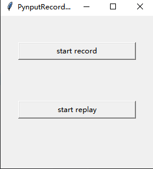

[GitHub](https://github.com/shigebeyond/pynput_recorder) | [Gitee](https://gitee.com/shigebeyond/pynput_recorder)

# pynput_recorder
Recorder GUI Application for [pynput](https://pypi.org/project/pynput), to record and replay mouse and keyboard input action.  

## Installation
Install from PyPi via pip:

```sh
pip3 install pynput_recorder
```

## Usage
1. python code
```
from pynput_recorder.recorder import run_recorder

run_recorder()
```

2. run python code


3. click `start record` button, it will record mouse and keyboard input actions until you press `ESC`, and save actions to `action.yml`

4. click `start replay` button, it will replay mouse and keyboard input actions
